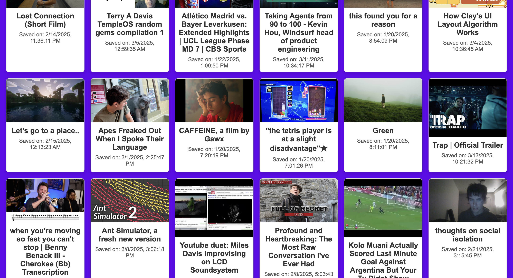

Contenta is a browser extension that helps you hold onto the videos that genuinely resonated with you — without needing to think about it. Unlike YouTube’s “Like” or “Watch Later” features, which rely on manual clicks and often get overlooked, Contenta quietly keeps track of what you’ve actually watched and suggests saving videos only when it seems like you really enjoyed them.
It’s built for people who find themselves losing track of great content — the talk that changed your mind, the short film you keep thinking about, the video you’d love to share with a friend. Contenta makes it easy to remember and revisit those moments.
This extension is also the first step toward a larger social app, where you and your friends can see each other's saved content — not as a feed of noise, but as a reflection of what you’ve truly connected with. While it currently works with YouTube, support for platforms like Netflix and Spotify is on the way.
Contenta isn’t about collecting clicks — it’s about making it easier to remember, reflect on, and share the content that actually stays with you.

🚀 Installation

1. Clone or download this repository.
2. Go to chrome://extensions in your browser.
3. Enable Developer Mode (top right).
4. Click Load unpacked.
5. Select the folder containing this project.
6. Start watching YouTube — the extension handles the rest!

Gallery

